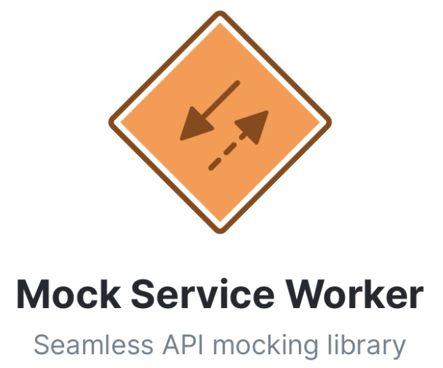

# ts 项目

## 项目特色

1. 使用 react17，typescript4 编写

1. 组件使用 css module 管理 css 样式，避免全局污染
   1. 设计规范：不同的环境，针对不同的用户群体，设计规范是不一样的
   2. 定制 theme

## 项目配置

1. theme 定制主题
   1. css modules
2. 加载媒体资源与字体
   1. create-react-app 默认配置好了媒体资源的 loader
   2. svg 图片格式当做组件来使用
3. tsconfig.json
   1. 路径别名 @ tsconfig.json
4. custom.d.ts
   1. .vscode/settings.json

### git 提交规范

1. git commit 提交规范
2. commitlint https://github.com/conventional-changelog/commitlint/tree/master/@commitlint/config-conventional
3. 格式化配置， prettier https://prettier.io/docs/en/install.html

## 项目依赖

1. [Create React App](https://github.com/facebook/create-react-app)
2. create-react-app 初始化 ts 项目

```bash
npx create-react-app create-ts --template typescript
```

3. package.json 管理依赖
   1. dependencies 项目上线的依赖
   2. devDependencies 项目开发的依赖，仅参与开发，与参与上线
      1. 各种 @types/ ，都给移动到 devDependencies
      2. 如果不放在这里，上线打包体积会大写
      3. test 测试文件

### antd 技术栈

icons antd 图标

aliyun-theme

```bash
yarn add antd @ant-design/icons
yarn add @ant-design/aliyun-theme # 阿里云主题

yarn add @ant-design/pro-form
yarn add @ant-design/pro-layout
yarn add @ant-design/pro-table
yarn add @ant-design/pro-list
yarn add @ant-design/pro-descriptions
yarn add @ant-design/pro-card
yarn add @ant-design/pro-skeleton

# 全部安装
npm install @ant-design/pro-form @ant-design/pro-layout @ant-design/pro-table  @ant-design/pro-list  @ant-design/pro-descriptions  @ant-design/pro-card  @ant-design/pro-skeleton --save
```

### env

https://github.com/toddbluhm/env-cmd

```bash
   yarn add env-cmd
```

根目录新建 .env-cmdrc.js

### craco-antd

1. craco 配置文档 https://ant.design/docs/react/use-in-typescript-cn
2. 安装 `craco-antd` 并修改 `craco.config.js` 文件
3. 代码规范工具的作用，无冲突配合使用的解决方案

```bash
yarn add craco-antd
```

`craco.config.js`

```jsx
const CracoAntDesignPlugin = require("craco-antd");

module.exports = {
  plugins: [
    {
      plugin: CracoAntDesignPlugin,
      options: {
        customizeTheme: {
          "@primary-color": "#1DA57A",
        },
      },
    },
  ],
};
```

css 修改，自定义主题需要用到类似 [less-loader](https://github.com/webpack-contrib/less-loader/) 提供的 less 变量覆盖功能

1. 把 `src/App.css` 文件修改为 `src/App.less`，然后修改样式引用为 less 文件
2. 配置主题文档 https://ant.design/docs/react/customize-theme-cn

```jsx
/* src/App.ts */
- import './App.css';
+ import './App.less'

/* src/App.less */
- @import '~antd/dist/antd.css'
```

### craco

1. 覆盖 create-react-app 的默认配置 https://github.com/gsoft-inc/craco
2. antd-craco 配置文档 https://ant.design/docs/react/use-with-create-react-app-cn
3. 安装依赖
   1. craco-antd https://github.com/DocSpring/craco-antd

```bash
yarn add craco-antd antd
```

替换 scripts 配置

```json
"scripts": {
  "start": "react-scripts start",
  "build": "react-scripts build",
  "test": "react-scripts test",
  "eject": "react-scripts eject",
  "json-server": "json-server __json_server__/db.json --watch"
},
```

替换为

```json
"scripts": {
  "start": "craco start",
  "build": "craco build",
  "test": "craco test",
  "eject": "react-scripts eject",
  "json-server": "json-server __json_server__/db.json --watch"
},
```

### 启动项目

```bash
yarn start
yarn test
yarn build
yarn eject
```

### yarn eject

**Note: this is a one-way operation. Once you `eject`, you can’t go back!**

If you aren’t satisfied with the build tool and configuration choices, you can `eject` at any time. This command will remove the single build dependency from your project.

Instead, it will copy all the configuration files and the transitive dependencies (webpack, Babel, ESLint, etc) right into your project so you have full control over them. All of the commands except `eject` will still work, but they will point to the copied scripts so you can tweak them. At this point you’re on your own.

You don’t have to ever use `eject`. The curated feature set is suitable for small and middle deployments, and you shouldn’t feel obligated to use this feature. However we understand that this tool wouldn’t be useful if you couldn’t customize it when you are ready for it.

## Service Worker

1. service Worker 分布式后端，充当了浏览器和网络之间的代理服务器
2. service workder API https://developer.mozilla.org/zh-cn/docs/web/api/service_worker_api

### 开发者控制台

1. MSW https://github.com/mswjs/msw
   1. 
2. jira-dev-tool https://www.npmjs.com/package/jira-dev-tool
   1. 所有请求被 Service Worker 代理，项目的健壮性
   2. HTTP 请求精准地控制: HTTP 请求的时间、失败概率、失败规则
   3. 后端逻辑处理后，以 localStorage 为数据库进行增删改查操作
   4. 每个浏览器都安装了一个独立的后端服务和数据库

```bash
npx imooc-jira-tool
```

index.tsx

```jsx
import { loadDevTools } from "jira-dev-tool";
loadDevTools(() => {
  ReactDOM.render(
    <React.StrictMode>
      <AppProviders>
        <App />
      </AppProviders>
    </React.StrictMode>,
    document.getElementById("root")
  );
});
```

## ts 类型定义

1. d.ts
2. 传入的参数，要进行类型定义，默认 any 类型：没有任何限制

```bash
yarn add @type/qs -D
```

3. ts 参数案例

```jsx
// ?: 可有可无
function getValue(value?: string) {}
```
